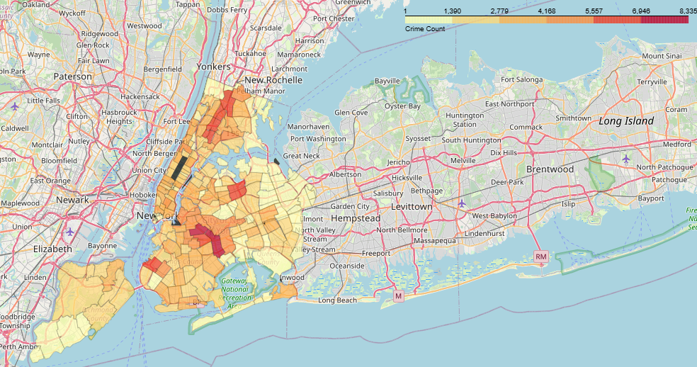
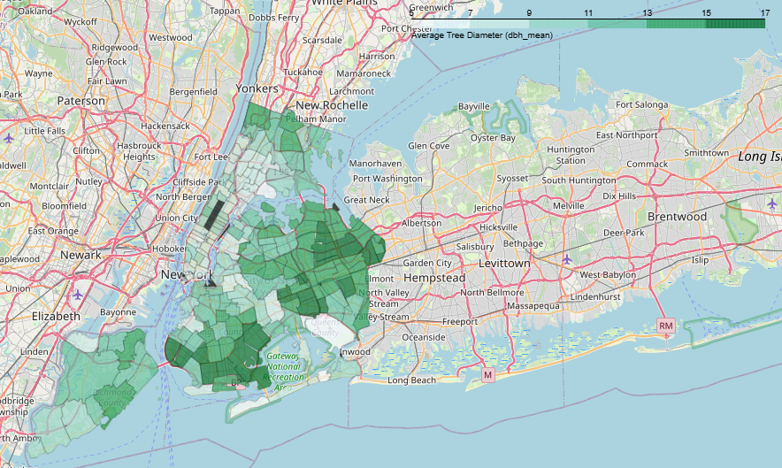

# Urban Computing Project

## Exploring the Relationship Between Urban Greenery and Crime Rates in New York City

This repository contains the research and analysis conducted to explore how urban greenery, specifically trees, impacts crime rates across New York City. By leveraging various datasets and machine learning techniques, this project identifies patterns and correlations that can inform urban planning and public safety initiatives.

## Screenshots

### Crime count heatmap


### Tree dbh mean heatmap


##  Features

- **Data Cleaning and Feature Engineering**: Merging and transforming NYC tree census and crime datasets for analysis.
- **Exploratory Data Analysis**: Visual insights through scatterplots and heatmaps to understand trends.
- **Machine Learning Models**: K-Nearest Neighbors (KNN) and K-Means Clustering to predict and classify crime rates based on tree-related data.
- **Spatial Analysis**: Heatmaps showcasing crime and tree health distribution across NYC zip codes.
- **Decision Tree Classifier**: Feature importance analysis to identify key factors influencing crime rates.

##  Project Structure

```
urban-computing/
├── Data/                    # Raw datasets (CSV files for trees and crime data)
├── Notebooks/               # Jupyter notebooks for analysis and visualization
├── Scripts/                 # Python scripts for data cleaning and modeling
├── Results/                 # Visualizations and result outputs (heatmaps, plots)
├── README.md                # Project documentation
└── requirements.txt         # List of dependencies
```

##  Datasets Used

- **NYC Tree Census (2015)** - Data on tree health, location, and species.
- **NYC Crime Data (2015)** - Crime incidents and penalties data.
- **NYC Zip Code GeoJSON** - Spatial boundaries for visual analysis.

##  Technologies and Tools

- **Python**
- **Pandas, NumPy** for data analysis
- **Matplotlib, Seaborn, Folium** for visualization
- **Scikit-learn** for machine learning models
- **GeoPandas** for spatial data analysis

##  Getting Started

1. **Clone the Repository:**
   ```bash
   git clone https://github.com/yash-kulkarni2000/urban-computing.git
   cd urban-computing
   ```
2. **Install Dependencies:**
   ```bash
   pip install -r requirements.txt
   ```
3. **Run Jupyter Notebook:**
   ```bash
   jupyter notebook
   ```

##  Usage

- Explore the `Notebooks/` for data cleaning, EDA, and modeling.
- Use `Scripts/` for feature engineering and visualization generation.
- Check `Results/` for generated heatmaps and clustering outputs.

##  Key Findings

- **Healthier Trees Correlate with Lower Crime Rates:** Areas with well-maintained trees had fewer crime penalties.
- **Tree Count vs. Crime Penalty:** More trees in a zip code correlated with less severe crimes.
- **Clustering Analysis:** K-Means clustering revealed distinct groupings of neighborhoods based on tree health and crime.
- **Spatial Insights:** Heatmaps highlighted that greener neighborhoods experienced lower crime rates.

##  Contributing

1. Fork the repository.
2. Create your feature branch (`git checkout -b feature-name`).
3. Commit your changes (`git commit -m 'Add feature'`).
4. Push to the branch (`git push origin feature-name`).
5. Open a Pull Request.


